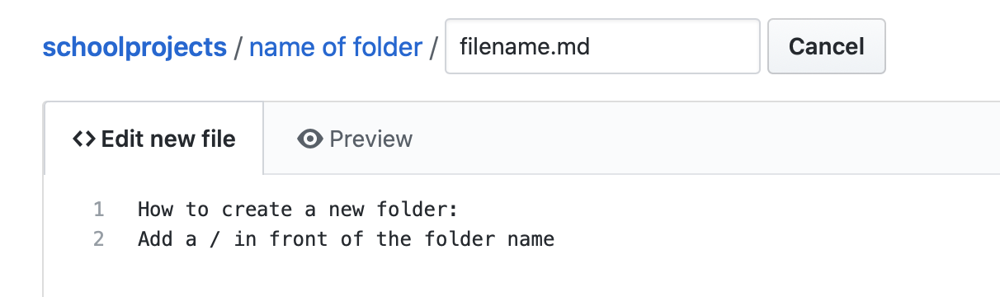

```{r setup, include=FALSE}
knitr::opts_chunk$set(echo = TRUE, eval=FALSE)
```

This guide is what I have learnt from building my GitHub portfolio. It also serves as a reminder for me when I need to refer to the codes again.

# Step 0: Install Git in Terminal (if you have not done so)

Whether you have Git already in your command shell can be easily verified with one command. Run `git` in your shell. If it says `command not found`, then you can go ahead and install Git. If Git is already installed, Terminal will list out some information and commands that you can run to use Git. 

Now that Git is installed, we can move on to Step 1.

# Step 1: Create a Repository

This will be done in the GitHub website, rather self-explanatory. For my repository, I named in 'schoolprojects'. 

# Step 2: Create a File in your computer

This can be done in Terminal using the following code:
```{bash}
mkdir schoolprojects
```

*Note that the name of the folder must correspond to the name of the repository made in Step 1.*

Once the folder has been created, a good practice is to create a README.md file to explain what the contents of the repository is about. This can be done from GitHub, but we shall try this from Terminal instead. The `echo` command will create a new file in the directory.

```{bash}
echo '#schoolprojects' >> README.md
cat README.md
```

# Step 3: Initialise and commit changes

```{bash}
git init
git commit -m 'README file'
```

# Step 4: Add a remote

```{bash}
git add remote add origin <repository URL>
```

# Step 5: Push the changes up to the repository

```{bash}
git push -u origin master
```

Once the changes are pushed, refresh your GitHub repository and admire your handiwork!

--------------------------------------------------------------------------------------

# Appendix A: Creating a folder in GitHub


</img>

```{r pressure, echo=FALSE, eval=TRUE, out.width = '100%'}

```

<!---->